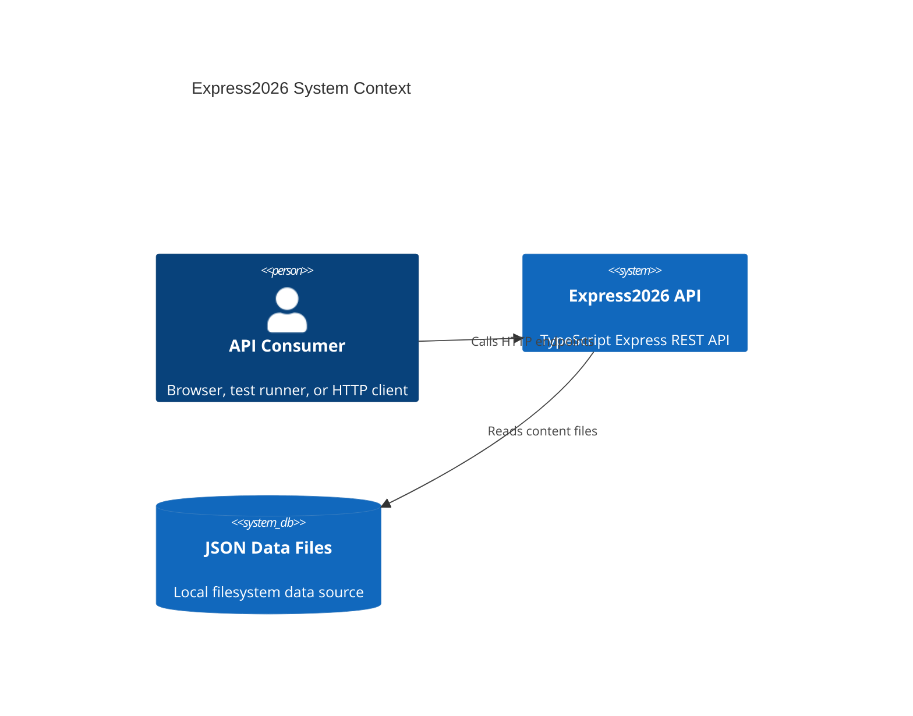
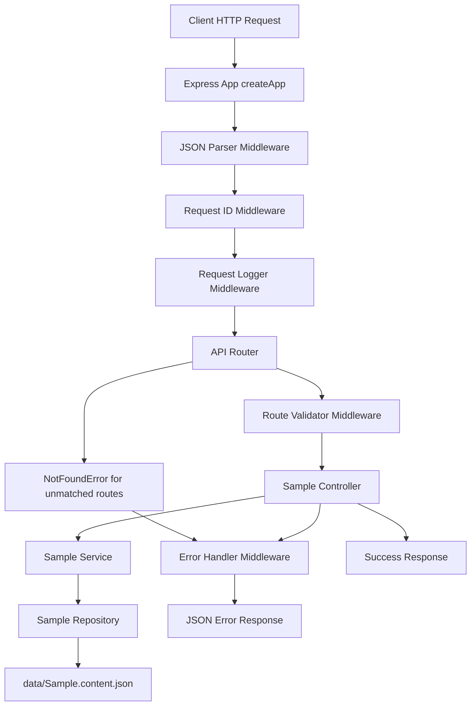

# Express2026 Architectural Design Document

TypeScript Express 5 boilerplate for a small REST API with strict layering and minimal dependencies.

### Table of Contents
- [Express2026 Architectural Design Document](#express2026-architectural-design-document)
		- [Table of Contents](#table-of-contents)
	- [Stack and tooling](#stack-and-tooling)
		- [Technology Stack](#technology-stack)
		- [Development Tools](#development-tools)
	- [Systems Architecture](#systems-architecture)
	- [Software Architecture](#software-architecture)
	- [Architecture Decisions Record (ADR)](#architecture-decisions-record-adr)
		- [ADR 1: Runtime bootstrap and app composition separation](#adr-1-runtime-bootstrap-and-app-composition-separation)
		- [ADR 2: Layered route architecture with functional router and OOP controller/service/repository](#adr-2-layered-route-architecture-with-functional-router-and-oop-controllerservicerepository)
		- [ADR 3: Error and validation strategy without third-party schema libraries](#adr-3-error-and-validation-strategy-without-third-party-schema-libraries)
		- [ADR 4: File-based content source for bootstrap simplicity](#adr-4-file-based-content-source-for-bootstrap-simplicity)
		- [ADR 5: Controller-level validation and shared functional validation utilities](#adr-5-controller-level-validation-and-shared-functional-validation-utilities)

## Stack and tooling

### Technology Stack
- **Language**: TypeScript in strict mode, ES2022 target, Node ESM
- **Runtime**: Node.js with Express
- **Data source**: JSON files in `data/` folder, accessed via a repository abstraction
- **Testing**: Vitest for unit tests and Playwright for end-to-end tests.
- **Static analysis**: Biome plus TypeScript type checking.

### Development Tools
- **Package management and scripts**: npm scripts from `package.json`.
- **Local development workflow**:
  - `npm run dev` runs `tsx watch src/server.ts` with `NODE_ENV=development`.
  - `npm run test:dev` runs Vitest in watch mode.
- **Quality and validation workflow**:
  - `npm run lint` runs Biome checks/fixes and `tsc --noEmit`.
  - `npm run test:unit` runs unit tests.
  - `npm run test:e2e` runs e2e tests.
  - `npm test` runs unit tests then e2e tests.
- **Build and deployment workflow**:
  - `npm run build` compiles to `dist/`.
  - `npm start` builds then starts `dist/server.js`.
- **CI/CD**: Not configured in repository yet

## Systems Architecture

The system is a single-process HTTP API server. Requests enter through Express middleware, route into a bounded route module (`home`), pass through controller-service-repository layers, and return either success payloads or structured errors. Runtime configuration is centralized in `src/env.config.ts`. Persistent content currently comes from local JSON files in `data/`.

## Software Architecture

The software architecture follows a layered modular style per route domain with thin framework edge and explicit infrastructure boundaries.

- **Composition boundary**: `src/app.factory.ts` builds middleware and router graph; `src/server.ts` only starts listening.
- **Route module structure**:
  - `sample.router.ts` defines route-to-handler mapping and middleware composition as a functional Express module.
  - `sample.controller.ts` handles HTTP contract (mandatory validation methods + response mapping) using OOP class methods.
  - `sample.service.ts` contains business logic (message assembly with timestamp).
  - `sample.repository.ts` isolates data access.
- **Cross-cutting modules**:
  - `request-id.middleware.ts` for request correlation (`x-request-id`) across logs and error responses.
  - `logger.middleware.ts` for request timing and status logging.
  - `error.middleware.ts` for translating `AppError` to `ApiErrorResponse` payloads and handling unknown errors.
  - `validate.middleware.ts` adapter (`makeMiddleware`) that converts request validator functions into Express middleware and maps validation errors to `AppError`.
  - `rest.consts.ts` for HTTP status codes and shared transport contracts such as `ApiErrorResponse`.
- **Data flow**:
  - Request: middleware -> router -> validation middleware -> controller -> service -> repository -> file utility.
  - Response: controller success path or centralized error middleware path.
- **Design patterns in use**:
  - **Factory functions** (`createApp`, `createApiRouter`) for top-level bootstrap.
  - **Object-Oriented classes** for route/business layers (`HomeController`, `HomeService`, `HomeRepository`).
  - **Dependency injection via constructor defaults** (class accepts dependencies with defaults).
  - **Repository pattern** for persistence abstraction.
  - **Middleware chain** for transport concerns.
  - **Explicit `this` binding at route registration time** (`controller.method.bind(controller)`) to keep controller methods in classic OOP style without arrow properties.

## Architecture Decisions Record (ADR)

### ADR 1: Runtime bootstrap and app composition separation
- **Decision**: Keep `src/server.ts` runtime-only (`listen`) and compose the Express instance in `src/app.factory.ts`.
- **Status**: Accepted
- **Context**: Tight coupling between bootstrap and app wiring makes testing and reuse harder, especially in small projects that still need e2e and unit feedback loops.
- **Consequences**: App composition is import-safe for tests and future hosting variants; startup behavior remains explicit and isolated.

### ADR 2: Layered route architecture with functional router and OOP controller/service/repository
- **Decision**: Use `router -> controller -> service -> repository` layering per route module, with a functional router module and OOP classes for controller/service/repository. Keep local constructor defaults instead of a global composition root, and bind controller methods in the router when passing callbacks to Express.
- **Status**: Accepted
- **Context**: The project optimizes for readability for OOP-oriented teams while keeping Express wiring idiomatic and low-ceremony.
- **Consequences**: Routing remains compact and familiar to Express users; controller classes stay clean and Java-like. Router files carry explicit binding noise (`bind`) by design.

### ADR 3: Error and validation strategy without third-party schema libraries
- **Decision**: Perform request validation with controller-level validator methods returning `Result` types (`Ok` and `Err`) to avoid `null` returns. Adapt those validator methods with `makeMiddleware` and standardize expected failures via `AppError`, centralized error middleware, and a shared `ApiErrorResponse` contract for error payload shape.
- **Status**: Accepted
- **Context**: The baseline aims to minimize dependencies, keep transport concerns at the HTTP edge, avoid repeating `isOk`/`400` boilerplate in every route, and avoid null-checks by using explicit Result objects.
- **Consequences**: Low dependency footprint and explicit behavior with a single reusable error-response shape; route folders stay compact with fewer files. Complex schemas may become verbose and could motivate introducing a schema library later.

### ADR 4: File-based content source for bootstrap simplicity
- **Decision**: Use filesystem JSON files in `data/` as the repository data source (`readJsonFile`).
- **Status**: Accepted
- **Context**: A lightweight baseline without database setup reduces onboarding friction.
- **Consequences**: Setup is trivial and deterministic for local/dev scenarios; concurrent writes, indexing, and operational scaling are limited compared to a real database.

### ADR 5: Controller-level validation and shared functional validation utilities
- **Decision**: Validation is mandatory at controller level for every endpoint. Do not create `*.validation.ts` files inside route folders. If validation logic is repeated across routes, extract reusable functional helpers to `src/shared/`.
- **Status**: Accepted
- **Context**: The team prefers an OOP mental model with fewer files per route module and explicit HTTP responsibility concentrated in controller + router.
- **Consequences**: Route module navigation is simpler and more consistent; controller files may grow and require periodic refactoring. Reuse is still supported through shared functional utilities without reintroducing per-route validation files.
