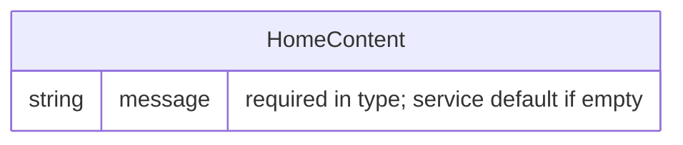

# Domain Model (E-R) — Express2026

## Overview

The domain model is minimal and file-backed: persisted content lives as JSON documents under `data/`, with TypeScript types co-located in route modules (e.g. `HomeContent` in `src/routes/home/home-content.type.ts`). There is no relational database, ORM, or migrations in-repo. Repositories read whole JSON files and map them to typed objects; the sample domain currently defines one content entity for the `home` route.

## E-R Diagram

## Entities — Detail

### HomeContent

Stored in `data/home.content.json`. Represents static welcome copy consumed by the `home` route.

| Field | Type | Constraints |
|-------|------|-------------|
| `message` | `string` | Required in `HomeContent` type; JSON must parse to an object with this property for typed reads; empty or missing value is replaced at service layer (see business rules) |

## Relationships and integrity rules

| Relationship | Cardinality | Integrity rule |
|-------------|-------------|----------------|
| — | — | No entity relationships; each content file is an independent document with no foreign keys |

## Cross-entity business rules

- **Home message default**: When `HomeContent.message` is empty or falsy after read, `HomeService.getHome` uses `"Hello World!"` before appending an ISO timestamp to the HTTP response string.
- **Content file availability**: `readJsonFile` expects `data/{fileName}` to exist and contain valid JSON; missing or unreadable files raise `InternalServerError` (not a domain validation error).
- **Singleton documents**: Each `*.content.json` file models one logical content record for its route; there is no multi-row table or identifier field beyond the file name convention (`home.content.json` → `HomeContent`).
