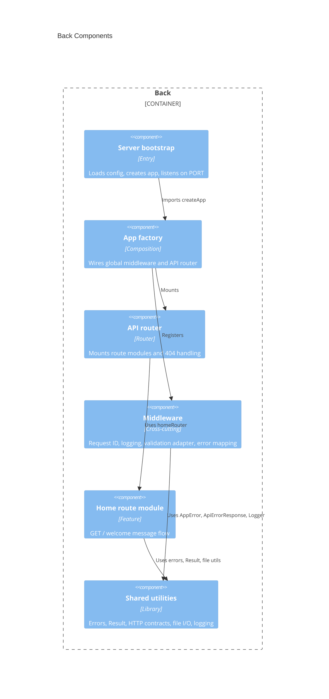
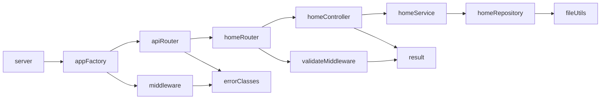

# Back Architecture — Express2026

## Overview

The back tier is a single Node.js process exposing a JSON-oriented HTTP API with Express 5. It composes cross-cutting middleware, mounts a central API router, and implements each domain as a feature folder under `src/routes/` with router → controller → service → repository layers. Runtime configuration lives in `env.config.ts`; persistence for the sample domain is JSON files under `data/` read through repositories.

## Technology stack

| Area | Choice |
|------|--------|
| Language | TypeScript 6 (strict, ES2022, Node ESM `nodenext`) |
| Framework | Express 5.2 |
| Testing | Vitest 4 (unit tests co-located under `src/`, `*.test.ts`) |
| Storage | JSON files in `data/` via `readJsonFile` (no database) |
| Security | None configured (no auth, CORS, or rate limiting in baseline) |
| Logging | `consoleLogger` + request logger middleware; errors logged with `x-request-id` |

## Development workflow

| Step | Command |
|------|---------|
| Init | `npm install` |
| Build | `npm run build` |
| Run | `npm run dev` (watch via `tsx`) / `npm run start` (build + `node dist/server.js`) |
| Test | `npm run test:unit` / `npm run test:dev` (Vitest watch) |
| Lint | `npm run lint` (Biome + `tsc --noEmit`) |
| Deploy | N/A (local `npm start`; no CI/CD in-repo) |

## C4 Diagram — Components



## Code organization

**Pattern**: Hybrid — feature-based folders under `routes/` with internal layers (router, controller, service, repository, types); cross-cutting concerns in `middleware/` and composition at the root of `src/`.

```text
src/
├── server.ts              # Listen only; PORT from appConfig
├── app.factory.ts         # createApp: middleware + API router
├── api.routes.ts          # Top-level API router, favicon, 404 → NotFoundError
├── env.config.ts          # PORT and NODE_ENV from environment
├── middleware/
│   ├── request-id.middleware.ts   # x-request-id on request/response
│   ├── logger.middleware.ts       # Request timing logs (skips favicon/devtools noise)
│   ├── validate.middleware.ts     # makeMiddleware: Result validators → BadRequestError
│   └── error.middleware.ts        # AppError → ApiErrorResponse JSON
├── routes/
│   └── home/              # Sample domain module
│       ├── home.router.ts
│       ├── home.controller.ts
│       ├── home.service.ts
│       ├── home.repository.ts
│       ├── home-content.type.ts
│       └── *.test.ts      # Vitest unit tests
└── shared/                # Tier-wide utilities and contracts
    ├── error.class.ts
    ├── result.type.ts
    ├── rest.consts.ts
    ├── file.utils.ts
    ├── logger.utils.ts
    └── request-context.types.ts
```

**New code must follow this pattern**: Add `src/routes/{domain}/` with `{domain}.router.ts`, `{domain}.controller.ts`, `{domain}.service.ts`, `{domain}.repository.ts`, and optional `{domain}-*.type.ts`; register the router in `api.routes.ts`; bind controller methods in the router; keep shared cross-route logic in `src/shared/`.

## Shared artifacts

| Path | Purpose |
|------|---------|
| `src/shared/error.class.ts` | `AppError` hierarchy (`NotFoundError`, `BadRequestError`, `InternalServerError`) |
| `src/shared/result.type.ts` | `Result`, `ok`, `err` for controller validators |
| `src/shared/rest.consts.ts` | `HTTP_CODES`, `ApiErrorResponse` shape |
| `src/shared/file.utils.ts` | `readJsonFile` from `data/` |
| `src/shared/logger.utils.ts` | `Logger` interface and `consoleLogger` |
| `src/shared/request-context.types.ts` | `RequestLocals` for `requestId` on `res.locals` |

## Key contracts

### HTTP routes (current)

| Method | Path | Success | Error |
|--------|------|---------|-------|
| `GET` | `/` | `200` — plain text body: `{message from data} {ISO timestamp}` | `400` JSON `ApiErrorResponse` if query string present |
| `GET` | `/favicon.ico` | `204` empty | — |
| `GET` | `/*` (unmatched) | — | `404` JSON `ApiErrorResponse` (`NOT_FOUND`, message includes path) |

### Error response (`ApiErrorResponse`)

| Field | Type | Source |
|-------|------|--------|
| `requestId` | `string` | `x-request-id` / `res.locals.requestId` |
| `error` | `string` | `AppError.code` (e.g. `BAD_REQUEST`, `NOT_FOUND`) |
| `message` | `string` | `AppError.message` |

### Domain types (back)

| Type | Location | Used by |
|------|----------|---------|
| `HomeContent` | `routes/home/home-content.type.ts` | `HomeRepository` → `data/home.content.json` |

### Environment

| Variable | Default | Effect |
|----------|---------|--------|
| `PORT` | `3000` | Listen port |
| `NODE_ENV` | `production` | Logged at startup |

## Dependencies between modules



- **Composition root**: `createApp` in `app.factory.ts` — no global DI container; route classes use constructor defaults (`new HomeRepository()`).
- **Validation flow**: Controller `validate*` methods return `Result` → `makeMiddleware` → `BadRequestError` → error middleware → `ApiErrorResponse`.
- **Data flow**: Controller → service → repository → `readJsonFile` → `data/*.json`.

## Constraints

- Keep `server.ts` listen-only; compose middleware and routers in `app.factory.ts` (ADR-1).
- Every endpoint must have a controller-level `validate*` method; no `*.validation.ts` per route (ADR-5).
- Use `Result` + `makeMiddleware` for request validation; map failures to `AppError` (ADR-3).
- Do not add per-route validation files or third-party schema libraries without superseding ADR-3.
- Repositories read JSON from `data/` only; no ORM or SQL in this tier until a new persistence ADR (ADR-4).
- Register new route modules in `api.routes.ts`; unmatched paths must surface `NotFoundError`.
- Use `.js` extensions in relative imports (Node ESM + `nodenext` resolution).
- Unit tests live beside implementation (`*.test.ts` under `src/`); E2E stays in `tests/` (HTTP-only).
