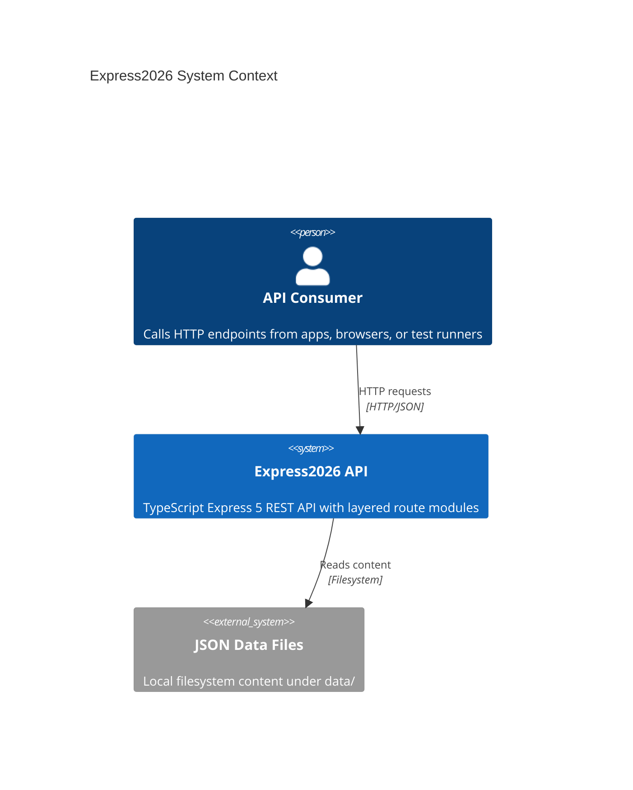
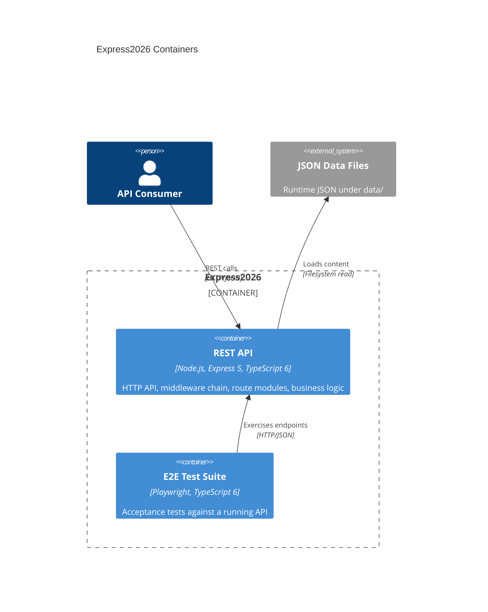

# System Architecture — Express2026

## Overview

Express2026 is a single-process HTTP REST API for developers building small backend services with TypeScript and Express 5. The system exposes JSON endpoints through a layered route architecture, persists read-only content from local JSON files, and returns structured success or error payloads. Target users are API consumers (browsers, HTTP clients, test runners) and engineers extending the boilerplate with new route modules.

## Key features

- Per-route layered modules: router, validation, controller, service, repository
- Structured errors and validation without third-party schema libraries
- JSON file storage under `data/` with a sample `home` route
- Vitest unit tests co-located in `src/` and Playwright E2E in `tests/`
- Request correlation via `x-request-id` and centralized error handling

## C4 Diagram — System Context

## C4 Diagram — Containers

## Containers — Detail

### REST API (`src/`)

- **Responsibility**: Accept HTTP requests, apply cross-cutting middleware (JSON parsing, request ID, logging, validation adapter, error handling), dispatch to route modules, and return JSON responses.
- **Technology**: Node.js ESM, TypeScript 6 (strict, ES2022), Express 5; Biome and `tsc` for static analysis; Vitest for unit tests under `src/`.
- **Constraints**: Single deployable process; no in-repo database or external service integrations; composition in `app.factory.ts`, listen-only bootstrap in `server.ts`; new domains added as folders under `routes/`.

### E2E Test Suite (`tests/`)

- **Responsibility**: Verify HTTP behavior and acceptance criteria against a running API instance (Chromium project in Playwright config).
- **Technology**: Playwright Test, TypeScript 6; invoked via `npm run test:e2e`.
- **Constraints**: Tests assume the API is reachable at the configured base URL; no direct imports of application internals—contract is HTTP only.

### JSON Data Files (`data/`)

- **Responsibility**: Hold runtime JSON content consumed by repository layers (e.g. `home.content.json`).
- **Technology**: Plain JSON on the local filesystem; accessed through repository abstractions in `src/`, not by HTTP clients directly.
- **Constraints**: Read-oriented bootstrap data; no migrations or schema tooling in-repo; not a substitute for a transactional database.

## Inter-container communication

| Source | Target | Protocol | Contract |
|--------|--------|----------|----------|
| API Consumer | REST API | HTTP/JSON | REST endpoints under the API router; success JSON bodies; `ApiErrorResponse` for failures |
| E2E Test Suite | REST API | HTTP/JSON | Same HTTP contract as external consumers; assertions on status, headers, and body |
| REST API | JSON Data Files | Filesystem | Repository reads JSON files from `data/`; content shape defined per route domain |
